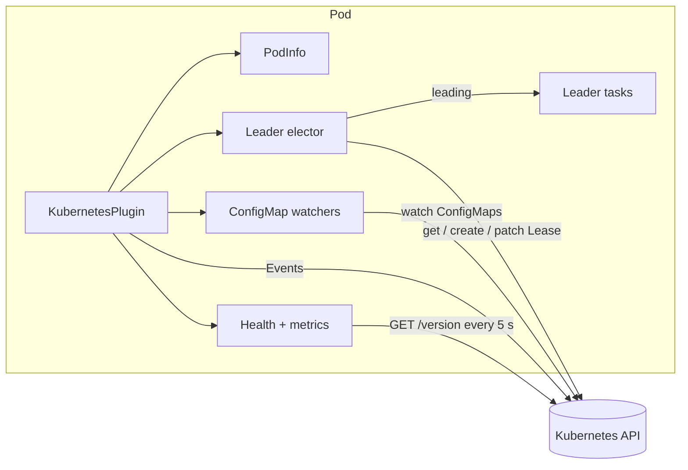
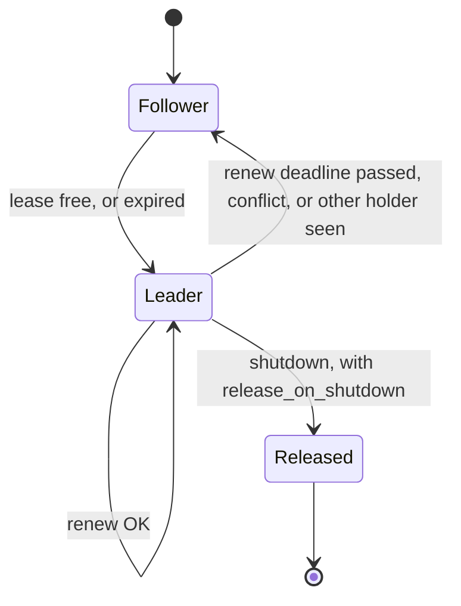

# autumn-plugin-kubernetes

Kubernetes plugin for [autumn-web](https://autumn-web.app) 0.7.

- **Pod identity** from the Downward API.
- **Leader election** on a `coordination.k8s.io/v1` Lease. Leader tasks run on one replica only.
- **Live ConfigMaps.** Read the latest data with no restart.
- **Kubernetes Events** on the pod: `Started`, `LeaderElected`, `LeaderLost`, `Stopping`.
- **Health indicator** and **Prometheus metrics**.
- **Manifests:** Deployment, Service, PDB, and least-privilege RBAC from your Autumn config.

It uses [`kube`](https://kube.rs) 4 and `k8s-openapi` 0.28.

## Install

```toml
[dependencies]
autumn-plugin-kubernetes = "0.1"
# Your app picks the Kubernetes API version (k8s-openapi rule).
k8s-openapi = { version = "0.28", features = ["v1_32"] }
```

You can also turn on the `latest` feature of this crate. Use it in apps only, not in libraries.
Supported: Kubernetes 1.32 to 1.36.

```rust
use autumn_plugin_kubernetes::{KubernetesPlugin, LeaderTask};

#[autumn_web::main]
async fn main() {
    autumn_web::app()
        .routes(routes![/* ... */])
        .plugin(KubernetesPlugin::new().leader_task(LeaderTask::new("sweeper", sweep)))
        .run()
        .await;
}

async fn sweep(state: AppState, cancel: CancellationToken) {
    // Runs on the leader only. Return before the stop timeout after
    // the plugin cancels `cancel` (4 s with the default timing).
}
```

## How it works





Leader election rules (proven in `verus/policy.rs`):

1. A follower takes over only when the lease record has not changed for `lease_duration` on its **own** clock. Clock skew between nodes has no effect.
2. A leader stops believing it leads `renew_deadline` after it **sent** its last successful write. Then its tasks get the cancel signal.
3. `renew_deadline < lease_duration`. So, with equal clock rates, two replicas never both believe they lead.
4. Writes use `resourceVersion`. A conflict loses the race and ends belief immediately.

Call `KubernetesRuntime::shutdown` (the plugin does it at app shutdown) to release the lease after the leader tasks stop. A drop with no shutdown does not release: the lease then expires after `lease_duration`.

`Leadership::is_leader` reads the belief deadline on the caller's clock. So a blocked elector task cannot leave a stale "leading".
A VM that pauses, or a large clock-rate drift, can break rule 3. If this matters, make a leader task safe to run twice.

## Config

```toml
[kubernetes]
enabled = true          # false: only PodInfo
required = false        # true: stop startup when no cluster answers
namespace = ""          # "": pod namespace, then the client default
events = true           # write Kubernetes Events on the pod

[kubernetes.leader_election]
enabled = false
lease_name = ""         # necessary when enabled
identity = ""           # "": <POD_NAME or HOSTNAME>-<8 hex digits>; one per process
lease_duration_secs = 15
renew_deadline_secs = 10
retry_period_secs = 2   # rule: renew > 1.2 * retry, lease > renew
release_on_shutdown = true
lead_when_detached = false  # local development only
roles = []              # [] = all; else "combined", "web", "worker"

[kubernetes.config_maps]
watch = []              # ConfigMap names in the namespace
```

The plugin loads config like autumn-web. The layers, from low to high:

1. `autumn.toml`.
2. `[profile.<name>.kubernetes]`.
3. `autumn-<profile>.toml`.
4. `.env`, with the same rules as autumn: dev and test only, unless `AUTUMN_DOTENV=1`.
5. Env vars.

Each file comes from `$AUTUMN_MANIFEST_DIR`. If the file is not there, the plugin reads it from the working directory.
Env example: `AUTUMN_KUBERNETES__LEADER_ELECTION__ENABLED=true`. Lists are comma separated.
With `server.strict_config`, autumn 0.7 accepts `[kubernetes]` only at the top level. Put profile values in `autumn-<profile>.toml`.

`KubernetesPlugin::readiness(true)` puts the health indicator in `/ready`.
The default is `/actuator/health` only, so an API outage does not stop traffic.

## Modes

| Mode | When |
|---|---|
| `kubeconfig` | `KUBECONFIG` or `~/.kube/config` exists. kube reads it first. |
| `in_cluster` | In a pod, with no kubeconfig. |
| `custom` | `with_api` or `with_connector`. |
| `detached` | No kubeconfig and no pod, and `required = false`. Leader tasks do not run unless `lead_when_detached = true`. |
| `disabled` | `enabled = false`. |

A kubeconfig that exists but does not load is an error. It does not give `detached`.

Proxies (kubeconfig mode only; in-cluster mode uses no proxy):

- The kubeconfig `proxy-url` wins. Else `HTTPS_PROXY` or `https_proxy` applies.
- kube has no `NO_PROXY`. For a local cluster (kind, minikube), unset `HTTPS_PROXY` for the app.
- Only HTTP proxies work. A `socks5://` proxy stops startup.

## Use in handlers

```rust
let pod = PodInfo::from_state(&state);                 // Option<Arc<PodInfo>>
let lead = Leadership::from_state(&state);             // Option<Arc<Leadership>>
let flags = ConfigMapStore::from_state(&state);        // Option<Arc<ConfigMapStore>>
let beta: Option<bool> = flags.and_then(|s| s.json("flags", "beta").ok().flatten());
let client = state.extension::<kube::Client>();        // your own API calls
```

## Health and metrics

Health indicator `kubernetes`: `mode`, `namespace`, `leader` (`lease`, `leading`), and `config_maps` (`waiting`, `present`, or `missing`).
On failure it shows a short `error` class only. It shows no URLs, tokens, versions, or pod names.
The API check result is reused: 5 s when up, 1 s when down.

| Metric | Kind | Labels |
|---|---|---|
| `kubernetes_leader` | gauge (belief) | `lease` |
| `kubernetes_leader_acquired_total` | counter | `lease` |
| `kubernetes_leader_lost_total` | counter | `lease` |
| `kubernetes_lease_errors_total` | counter (lost races not counted) | `lease` |
| `kubernetes_lease_conflicts_total` | counter (lost races, normal) | `lease` |
| `kubernetes_events_published_total` | counter | |
| `kubernetes_events_failed_total` | counter | |
| `kubernetes_api_up` | gauge (checked every 5 s) | |
| `kubernetes_config_map_updates_total` | counter | `config_map` |
| `kubernetes_config_map_errors_total` | counter | `config_map` |

## Manifests

```bash
cargo run --example manifests -- shop ghcr.io/acme/shop:1.0.0 shop-ns --profile prod > k8s.yaml
kubectl apply -f k8s.yaml
```

The example loads your real Autumn config. It needs the pod profile (`--profile` or `AUTUMN_ENV`): without one, autumn uses dev, with a 1 s shutdown timeout. The Deployment sets `AUTUMN_ENV` to that profile. In code: `ManifestSpec::from_config(name, image, &autumn_config, &kube_config).render_yaml()`.

- The probes come from `health.live_path`, `ready_path`, and `startup_path`. Readiness fails on the first 503.
- `terminationGracePeriodSeconds = preStop + prestop_grace + shutdown_timeout + buffer` (Autumn formula).
- `preStop` uses the `sleep` action. The image needs no shell.
- `AUTUMN_SERVER__HOST=0.0.0.0`. Autumn binds `127.0.0.1` by default, and probes need all interfaces.
- The Role has only the verbs that the config needs. All Lease and ConfigMap rules use `resourceNames`. The elector creates its Lease with a PUT, so `create` also has a name limit.
- The service account token mounts when the plugin is enabled.

## Tests

```rust
use autumn_plugin_kubernetes::api::MemoryKubeApi;
let api = MemoryKubeApi::new();
let plugin = KubernetesPlugin::new().with_api(api.clone());
```

`MemoryKubeApi` passes the same contract tests as a real API server.
Use `KubernetesPlugin::start` for runtime tests. `TestApp` stops tasks that start in startup hooks.

## Limits

- `#[scheduled]` tasks do not use the Lease. autumn-web 0.7 has no public scheduler hook. See ADR 0001.
- The plugin does not read `binaryData` in a ConfigMap. It does not watch Secrets. Mount Secrets as files.
- If a later startup hook fails, autumn exits with no shutdown hooks. A lease that this replica holds then stays until `lease_duration` ends.

## Development

See `CLAUDE.md`. License: Apache-2.0.
