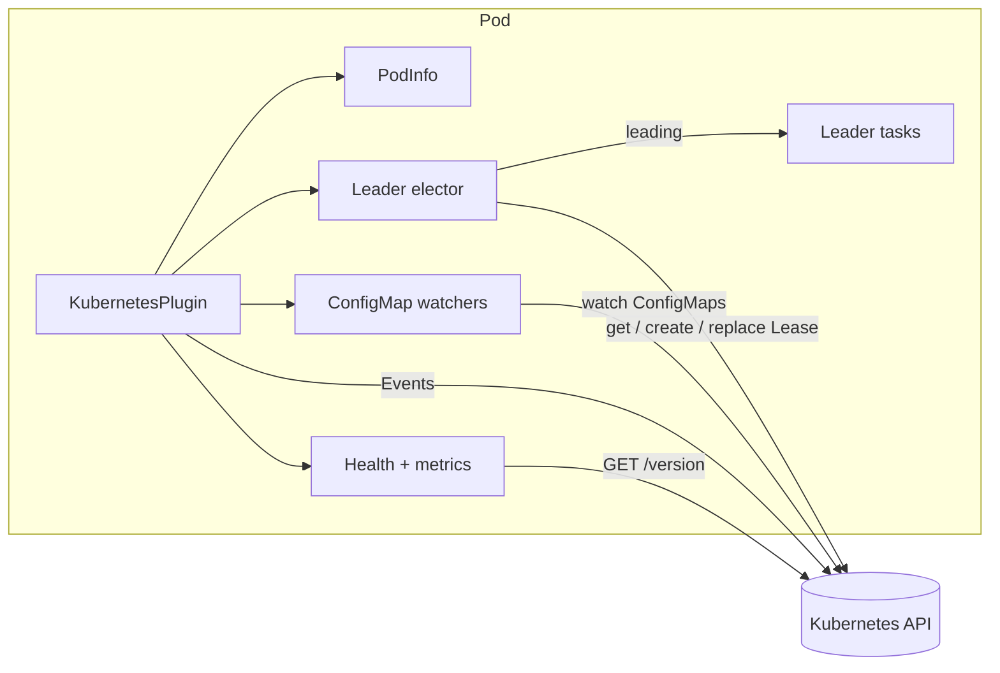
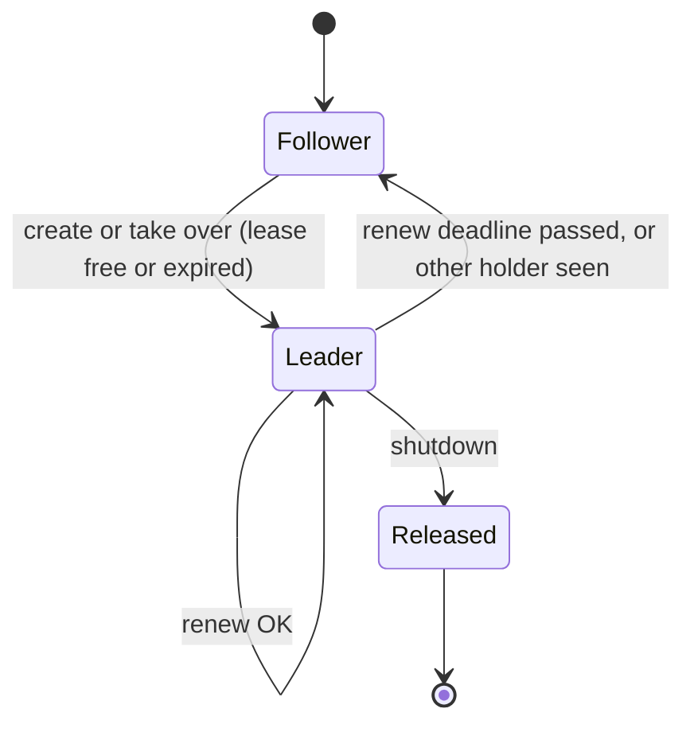

# Plan: `autumn-plugin-kubernetes`

Style: ASD-STE100. Short sentences. Active voice.

## 1. Problem

Many teams run Autumn apps on Kubernetes.
Autumn 0.7 gives probes (`/live`, `/ready`, `/startup`), a graceful drain,
and process roles. It does not talk to the Kubernetes API.
Teams write the same glue again and again:

- Read the pod name and namespace.
- Run one singleton task in a fleet of replicas without Postgres.
- Read live settings from a ConfigMap.
- Write Deployment YAML with correct probes and grace periods.

This plugin gives that glue as a one-line install.

## 2. Autumn footprint (sources)

| Autumn feature | Doc | Plugin use |
|---|---|---|
| `Plugin` trait | `extensibility` | `KubernetesPlugin` is a one-line install. |
| `on_startup`, `on_shutdown` | `extensibility` | Start the elector and watchers. Release the lease on shutdown. |
| `HealthIndicator` | `health-indicators` | Report API server reachability and leader state. |
| `MetricsSource` | `metrics-sources` | Export leader and API counters. |
| Probes and drain | `cloud-native` | Use the probe paths and the grace formula in the manifests. |
| `config_section` | `extensibility` | Declare `[kubernetes]` so strict config accepts it. |
| Process roles | `jobs` | Leader tasks can be limited to worker roles. |

## 3. Crates

| Crate | Why |
|---|---|
| `kube` 4 (`client`, `runtime`) | The standard Kubernetes client for Rust. CNCF project. Watchers and event recorder. |
| `k8s-openapi` 0.28 | Typed Kubernetes objects. Used by `kube`. |
| `serde-saphyr` | YAML output. `kube-client` uses it already. No new YAML crate. |
| `thiserror`, `serde`, `tokio`, `tracing` | Same as the other Autumn plugins. |

## 4. Brainstorming (use cases)

1. **Pod identity.** Read name, namespace, node, IP, and service account from the Downward API.
2. **Kube client.** Give the app a ready `kube::Client` (in cluster, or kubeconfig for dev).
3. **Leader election** (prime). A `coordination.k8s.io/v1` Lease elects one replica. Leader tasks run only on it.
4. **Live ConfigMaps.** Watch named ConfigMaps. The app reads the latest data. No restart.
5. **Kubernetes Events.** Write `Started`, `LeaderElected`, `LeaderLost`, `Stopping` events on the pod.
6. **Health and metrics.** API reachability, leader state, error counters.
7. **Manifests.** Make Deployment, Service, PDB, ServiceAccount, Role, and RoleBinding YAML from the Autumn config.
8. **Fast failover.** Release the lease on shutdown.
9. **Later (not in scope):** controllers for CRDs, EndpointSlice discovery, Secret watch, admission webhooks.

Selected scope: items 1 to 8.

## 5. Reverse brainstorming (how to make it fail)

| How to fail | Counter-measure |
|---|---|
| Two replicas think they lead at the same time. | Leader belief ends at `renew_deadline` after the last good renew was **sent**. Takeover needs `lease_duration` after the record was **seen**. `renew_deadline < lease_duration`. Proven in Verus. |
| Clock skew between nodes breaks expiry. | Expiry uses the local monotonic time when the record last changed. Remote timestamps are not used. |
| Two candidates write the lease at once. | Replace with `resourceVersion`. A 409 conflict loses the race. |
| Leader keeps running after a lost renew. | Leader tasks get a cancel token. It fires when belief ends. |
| Bad timing config (renew >= duration). | Reject at startup. Proven rule. |
| Retry jitter pushes past the renew deadline. | Jitter is at most 20%. Config rule: `renew_deadline > 1.2 * retry_period`. |
| Slow failover after a rolling update. | Release the lease on shutdown (holder empty). |
| Two processes in one pod share an identity. | Default identity adds a random suffix. |
| A Kubernetes API outage drops all traffic. | Health indicator is health-only by default. `/ready` opt-in. |
| The plugin breaks local dev with no cluster. | `required = false` by default. With no cluster, run detached. Pod info still works. |
| Missing RBAC. | Manifest output gives the exact Role. Errors name the verb and resource. |
| A malformed ConfigMap stops the app. | Store raw strings. Typed parse is per read and returns an error. |
| A watcher dies on a network error. | `kube` watcher retries with backoff. Count errors. |
| Leak secrets or tokens. | Never log tokens. Do not watch Secrets. Health output has no URLs. |
| Grace period too short: pods get SIGKILL. | Compute `preStop + prestop_grace + shutdown_timeout + buffer`. Saturating. Proven. |
| Metric label cardinality grows. | Labels are lease and ConfigMap names from config only. |
| Tests need a cluster. | `KubeApi` trait with a public `MemoryKubeApi` fake. Real API server tests with `kube-apiserver` + `etcd` binaries (no containers). |

Found during implementation:

| How to fail | Counter-measure |
|---|---|
| Probes fail: Autumn binds `127.0.0.1` by default. | Manifest sets `AUTUMN_SERVER__HOST=0.0.0.0`. |
| A dead elector (panic) keeps its last "leading" view. | A closed state channel reads as not leading. |
| The fake drifts from the real server (create on update). | One contract for fake and real client. |
| A library k8s-openapi feature breaks apps on another version. | No feature in the library. CI checks 1.32 to 1.36. JSON where a type changes. |
| `HTTPS_PROXY` in kubeconfig mode stops the client. | Turn on kube `http-proxy`. |
| `exec sleep` fails on distroless images. | `preStop` `sleep` action. |
| Detached replicas outside Kubernetes all run the singleton. | Leader tasks run detached only with `lead_when_detached`. |
| Huge `retry_period` overflows the timing check (Verus found it). | Reject `retry >= renew` first. |

## 6. Six thinking hats

- **White (facts):** Lease fields: `holderIdentity`, `leaseDurationSeconds`, `acquireTime`, `renewTime`, `leaseTransitions`. client-go uses the observed time, not `renewTime`, for expiry. Update needs a matching `resourceVersion`. Events use `events.k8s.io/v1`. Autumn default shutdown timeout is 30 s.
- **Red (feelings):** Users want "one leader, no Postgres" to just work. They fear split brain. They want YAML they can trust.
- **Black (risks):** Autumn `#[scheduled]` coordination is closed (`SchedulerLease::local` is `pub(crate)`). The plugin cannot plug into it. Leader tasks are a separate API. Clock drift is not modelled. A paused VM can outlive its belief window. We document this.
- **Yellow (benefits):** Singleton work with no database. Faster failover than advisory locks on a dead connection. Live config. Correct manifests.
- **Green (ideas):** Upstream seam: a public `SchedulerCoordinator` install hook. Then `#[scheduled]` can use the Lease. See ADR 0001.
- **Blue (process):** Spec the pure policy core in Verus first. Write failing tests. Implement. Refactor. Review with agents from several angles. Check each AC.

## 7. Design

Modules:

ADRs: `docs/adr/0001` to `0004`.

- `policy` — pure rules. Verified core.
- `api` — `KubeApi` trait, `KubeClientApi` (real), `MemoryKubeApi` (fake).
- `config` — `[kubernetes]` config and validation.
- `pod` — `PodInfo`.
- `leader` — elector loop and `Leadership` handle.
- `configmap` — `ConfigMapStore`.
- `health`, `metrics` — actuator parts.
- `manifest` — YAML generator.
- `plugin` — `KubernetesPlugin` and `KubernetesRuntime`.

## 8. Acceptance criteria

- **AC1** `KubernetesPlugin` implements `autumn_web::plugin::Plugin`. One call installs it. It declares `[kubernetes]`.
- **AC2** `PodInfo` reads pod name, namespace, node, IP, and service account from the Downward API env and the service account files. The app gets it from the state.
- **AC3** The plugin connects in cluster or with a kubeconfig. With no cluster and `required = false`, it runs detached. With `required = true`, startup fails. The app gets the `kube::Client`.
- **AC4** Leader election on a Lease: create, renew, take over when expired, lose on conflict or deadline, release on shutdown. `Leadership` gives `is_leader`, a change stream, and a wait call.
- **AC5** At most one replica believes it leads at a time, given equal clock rates. Verus proves the rule. Tests show failover with three candidates.
- **AC6** Leader tasks run only while the replica leads. They get a cancel token when leadership ends. Role gating is available.
- **AC7** ConfigMap watch: the app reads the latest data of each watched ConfigMap. Updates and deletes show within one watch event. Typed JSON reads return errors, not panics.
- **AC8** Kubernetes Events for start, leader change, and stop, on the pod. Failures do not stop the app.
- **AC9** Health indicator `kubernetes`: API reachability, mode, leader state. Health-only by default. `/ready` opt-in. No URLs or tokens in output.
- **AC10** Metrics source with leader gauge, transitions, lease errors, ConfigMap updates, and event counts.
- **AC11** Manifest generator: Deployment (probes from Autumn paths, Downward API env, preStop, grace period by the Autumn formula), Service, PDB, ServiceAccount, Role, RoleBinding. The Role has only the verbs the config needs. Output is valid YAML that a real API server accepts.
- **AC12** Config: serde `[kubernetes]` section, profile files, `AUTUMN_KUBERNETES__*` env overlay, and validation of lease timing.
- **AC13** `MemoryKubeApi` is public for app tests.
- **AC14** Integration tests against a real `kube-apiserver`: Lease election, ConfigMap watch, Events, and manifest apply (server-side dry run).
- **AC15** `cargo fmt`, clippy pedantic and nursery clean. No `unwrap` in production code. Unit, property, and integration tests pass. Coverage 85% or more. CI runs these.
- **AC16** Verus specs state the policy invariants. Proofs pass.
- **AC17** README, CLAUDE.md, ADRs, Mermaid diagrams, an example app. All docs use ASD-STE100.
